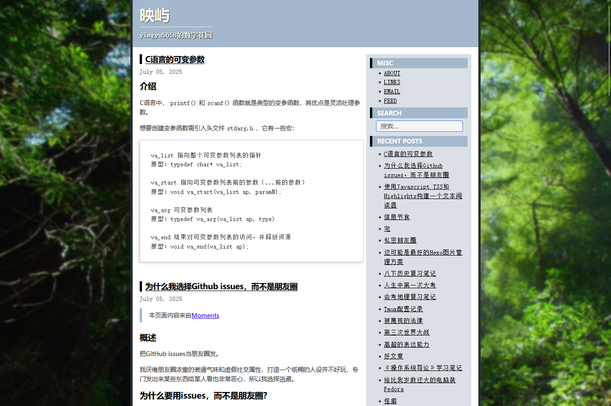

# hugo-theme-cloud
Cloud 是一个简洁现 Hugo 主题，提供清爽的阅读体验和。适用于个人博客、技术文档等场景。

## 预览



[Demo](https://www.yingyu5658.me)

## 安装

### 直接克隆

```Bash
cd your-hugo-site/themes
git clone https://github.com/yingyu5658/hugo-theme-cloud
```

## 配置

在站点 `hugo.toml` 中启用主题：

```toml
theme = "cloud"
```

**站点基础配置示例**

```toml
baseURL = "https://www.yingyu5658.me/"
publishDir = "public"
title = "映屿"
description = "yingyu5658的数字花园"
languageCode = "zh-CN"
pagination = { pagerSize = 4 }
theme = ["cloud"]

[Params]
  post_meta = ["date"]
  mainSections = ["post"]
  copyright = "©2024 映屿. All rights reserved."
  giscusDarkTheme = "dark_dimmed"

[Params.giscus]
repo = ""
repoId = ""
category = ""
categoryId = ""
mapping = ""
strict = 0
reactionsEnabled = 1
emitMetadata = 0
inputPosition = "bottom"
theme = "noborder_light"
lang = "zh-CN"
loading = "lazy"


[Params.topbar]
  subtitle = "yingyu5658的数字花园"

[Params.sidebar]
  home = "right"
  widgets = ["misc", "search","categories" ,"recent", "archives"]

[Params.widgets]
  recent_num = 30
  [[Params.widgets.misc.custom]]
  title = "ABOUT"
  url = "/about"
  [[Params.widgets.misc.custom]]
  title = "LINKS"
  url = "/links"
  [[Params.widgets.misc.custom]]
  title = "EMAIL"
  url = "mailto:yingyu5658@outlook.com"
  [[Params.widgets.misc.custom]]
  title = "FEED"
  url = "/"
```

## 贡献指南

欢迎提交 Issues 或 Pull Requests：

1. Fork 仓库
2. 创建新分支 (`git checkout -b feature/your-feature`)
3. 提交修改 (`git commit -am 'Add some feature'`)
4. 推送分支 (`git push origin feature/your-feature`)
5. 创建 Pull Request

## 协议

本项目衍生于[JiaoYuan的博客](https://github.com/imjiaoyuan/imjiaoyuan.github.io/tree/main/themes/cloud)

[MIT](https://github.com/yingyu5658/hugo-theme-cloud?tab=MIT-1-ov-file)

